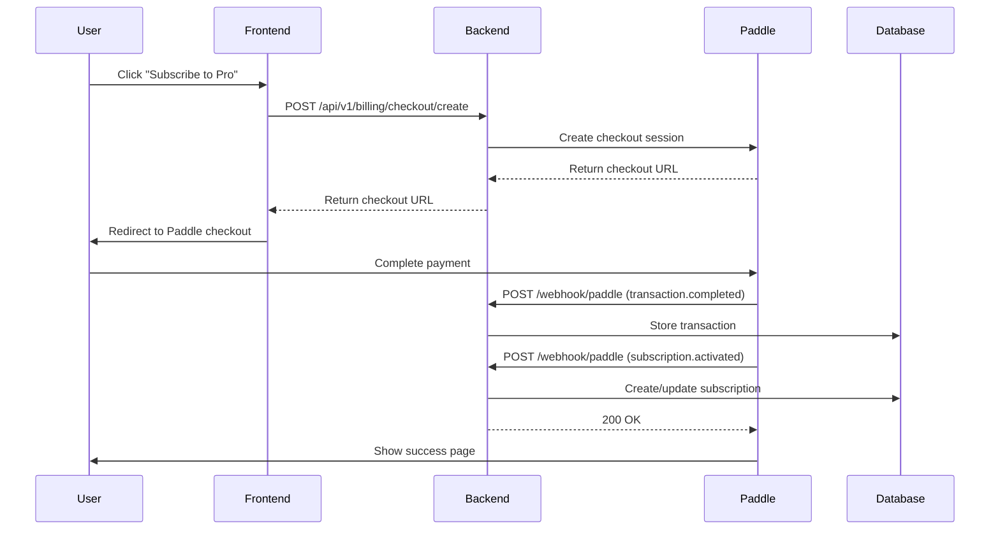

# Paddle Webhook Setup Guide

This guide explains how to configure Paddle webhooks for both **Sandbox** (testing) and **Production** (live) environments.

---

## Prerequisites

Before setting up webhooks, ensure you have:

1. ✅ Paddle account (both Sandbox and Production access)
2. ✅ Backend deployed and accessible via HTTPS (Paddle requires HTTPS for webhooks)
3. ✅ `PADDLE_WEBHOOK_SECRET` environment variable ready to store

---

## Webhook URL Format

Your webhook endpoint will be:

```
https://yourdomain.com/api/v1/billing/webhook/paddle
```

**For local development/testing:**

- Use a tunneling service like [ngrok](https://ngrok.com/) or [Cloudflare Tunnel](https://developers.cloudflare.com/cloudflare-one/connections/connect-apps/)
- Example: `https://abc123.ngrok.io/api/v1/billing/webhook/paddle`

---

## Setup Instructions

### 🧪 **Sandbox Environment Setup**

1. **Login to Paddle Sandbox Dashboard**
   - Go to: https://sandbox-vendors.paddle.com/
   - Use your Paddle sandbox credentials

2. **Navigate to Webhooks**
   - Click **Developer Tools** in the left sidebar
   - Select **Webhooks**

3. **Create New Webhook**
   - Click **+ New Webhook Destination**
   - Enter your webhook URL: `https://yourdomain.com/api/v1/billing/webhook/paddle`
   - Click **Save**

4. **Copy Webhook Secret**
   - After creating, Paddle will show you a **Webhook Secret**
   - Copy this secret (it looks like: `pdl_ntfset_01j...`)
   - Add to your `.env` file:
     ```env
     PADDLE_WEBHOOK_SECRET=pdl_ntfset_01j...
     PADDLE_ENV=sandbox
     ```

5. **Select Events to Subscribe**

   Check the following events:

   **Subscription Events:**
   - ✅ `subscription.created`
   - ✅ `subscription.activated`
   - ✅ `subscription.updated`
   - ✅ `subscription.paused`
   - ✅ `subscription.resumed`
   - ✅ `subscription.canceled`

   **Transaction Events:**
   - ✅ `transaction.completed`
   - ✅ `transaction.payment_failed`
   - ✅ `transaction.updated`

   **Customer Events (Optional but recommended):**
   - ✅ `customer.created`
   - ✅ `customer.updated`

6. **Save Configuration**
   - Click **Save** at the bottom

---

### 🚀 **Production Environment Setup**

1. **Login to Paddle Production Dashboard**
   - Go to: https://vendors.paddle.com/
   - Use your Paddle production credentials

2. **Navigate to Webhooks**
   - Click **Developer Tools** in the left sidebar
   - Select **Webhooks**

3. **Create New Webhook**
   - Click **+ New Webhook Destination**
   - Enter your **production** webhook URL: `https://api.yourdomain.com/api/v1/billing/webhook/paddle`
   - Click **Save**

4. **Copy Production Webhook Secret**
   - Copy the webhook secret shown
   - Add to your **production** `.env` file:
     ```env
     PADDLE_WEBHOOK_SECRET=pdl_ntfset_01k...
     PADDLE_ENV=production
     ```

5. **Select Same Events as Sandbox**
   - Follow the same event selection as step 5 in Sandbox setup

6. **Save Configuration**

---

## Testing Webhooks

### Method 1: Using Paddle's Test Tool

1. In Paddle Dashboard → **Developer Tools** → **Webhooks**
2. Click on your webhook destination
3. Click **Send Test Event**
4. Select an event type (e.g., `transaction.completed`)
5. Click **Send**
6. Check your server logs to verify the webhook was received

### Method 2: Using Paddle Sandbox

1. Create a test checkout in Paddle Sandbox
2. Use Paddle's test card numbers:
   - **Success**: `4242 4242 4242 4242`
   - **Decline**: `4000 0000 0000 0002`
3. Complete the checkout
4. Verify webhook events are received in your database:
   ```sql
   SELECT * FROM paddle_webhook_events ORDER BY created_at DESC LIMIT 10;
   ```

### Method 3: Using ngrok for Local Testing

1. **Install ngrok:**

   ```bash
   npm install -g ngrok
   ```

2. **Start your local server:**

   ```bash
   npm run dev
   ```

3. **Start ngrok tunnel:**

   ```bash
   ngrok http 8000
   ```

4. **Copy the HTTPS URL** (e.g., `https://abc123.ngrok.io`)

5. **Update Paddle webhook URL** to:

   ```
   https://abc123.ngrok.io/api/v1/billing/webhook/paddle
   ```

6. **Test with Paddle Sandbox checkout**

---

## Webhook Event Flow

Here's what happens when a user subscribes:



---

## Verifying Webhook Setup

### Check 1: Webhook Secret is Configured

```bash
# In your terminal
echo $PADDLE_WEBHOOK_SECRET
```

Should output: `pdl_ntfset_01j...`

### Check 2: Endpoint is Accessible

```bash
curl -X POST https://yourdomain.com/api/v1/billing/webhook/paddle \
  -H "Content-Type: application/json" \
  -d '{"test": true}'
```

Should return `400` (signature verification will fail, but endpoint is reachable)

### Check 3: Database Tables Exist

```sql
-- Check if webhook events table exists
SELECT COUNT(*) FROM paddle_webhook_events;

-- Check if transactions table exists
SELECT COUNT(*) FROM paddle_transactions;

-- Check if subscriptions table exists
SELECT COUNT(*) FROM users_subscriptions;
```

---

## Troubleshooting

### ❌ Webhook not receiving events

**Solution:**

1. Verify webhook URL is correct in Paddle dashboard
2. Ensure your server is accessible via HTTPS
3. Check firewall/security group settings
4. Verify `PADDLE_WEBHOOK_SECRET` matches Paddle dashboard

### ❌ Signature verification failing

**Solution:**

1. Ensure you're using the correct webhook secret for the environment (sandbox vs production)
2. Verify raw body is being passed to verification function
3. Check that `express.json()` middleware is configured correctly with `verify` callback

### ❌ Events marked as unprocessed

**Solution:**

1. Check `paddle_webhook_events` table for `error_message`
2. Review server logs for errors
3. Verify database schema matches expected fields
4. Check that `website_subscriptions` table has `paddle_price_id` column

### ❌ User ID not found in webhook

**Solution:**

1. Ensure `customData.userId` is set when creating Paddle customer
2. Verify customer metadata is being passed correctly in checkout creation
3. Check that `getUserIdFromCustomer` function can retrieve user ID

---

## Security Best Practices

1. **Always verify webhook signatures** - Never process webhooks without signature verification
2. **Use HTTPS only** - Paddle requires HTTPS for webhooks
3. **Implement idempotency** - Check `event_id` to prevent duplicate processing
4. **Store webhook secrets securely** - Use environment variables, never commit to git
5. **Log all webhook events** - Store in `paddle_webhook_events` for debugging
6. **Return 200 quickly** - Process webhooks asynchronously if needed
7. **Monitor failed webhooks** - Set up alerts for `processed = false` events

---

## Environment Variables Checklist

Add these to your `.env` file:

```env
# Paddle Configuration
PADDLE_API_KEY=your_paddle_api_key_here
PADDLE_WEBHOOK_SECRET=pdl_ntfset_01j...
PADDLE_ENV=sandbox  # or "production"

# Frontend URL (for checkout redirects)
FRONTEND_URL=https://yourdomain.com
```

---

## Next Steps

1. ✅ Set up webhooks in Paddle Sandbox
2. ✅ Test with Paddle test cards
3. ✅ Verify events are being stored in database
4. ✅ Set up webhooks in Paddle Production
5. ✅ Monitor webhook events in production
6. ✅ Set up alerts for failed webhooks

---

## Useful Links

- [Paddle Webhook Documentation](https://developer.paddle.com/webhooks/overview)
- [Paddle Event Reference](https://developer.paddle.com/webhooks/event-reference)
- [Paddle Sandbox Dashboard](https://sandbox-vendors.paddle.com/)
- [Paddle Production Dashboard](https://vendors.paddle.com/)
- [Paddle Test Cards](https://developer.paddle.com/concepts/payment-methods/credit-debit-card#test-card-numbers)
